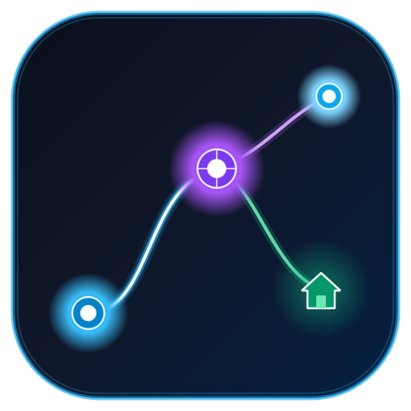

# Topofiberix - FTTH Network Planner
<p align="left">
  
</p>

Aplikasi desktop profesional berbasis **Python 3**, **PyQt6**, **PyQt6-WebEngine**, dan **Leaflet.js** untuk perencanaan jaringan fiber optik (*Fiber to the Home* / FTTH), pengambilan titik koordinat lapangan, kalkulasi jarak bentangan dan *slack* kabel, serta ekspor data spasial lengkap (titik & garis rute) ke **Google Earth Pro (KML 2.2)**.

## 🖥️ Tata Letak Antarmuka (Modern GIS Layout)
- **Panel Kiri (Form Kontrol & Rekayasa Jaringan):**
  Membungkus Form Input Simpul FTTH, Panel Routing Kabel (Road-Snapped), Slider Slack, Generator Tiang Otomatis, Tabel Simpul & Rute, serta Tombol Ekspor KML.
- **Panel Kanan (Viewport Spasial & Pencarian):**
  Membungkus Kotak Pencarian Geocoding di bagian atas dan Peta Interaktif Leaflet GIS (`QWebEngineView`) yang mengisi seluruh sisa layar secara dinamis dan responsif (menggunakan `QSplitter` dengan proporsi 1:3).

---

## 🚀 Fitur Lengkap Aplikasi

### 📍 Modul 1: Peta Interaktif & Survey Spasial GIS
1. **Peta Interaktif Leaflet GIS**
   - Multi-layer: 🗺️ Peta Jalan (OSM), 🛰️ Citra Satelit (Esri World Imagery), dan 🌙 Peta Kontras Gelap (CartoDB).
   - Animasi penanda klik sementara (*pulsing pulse pin*).
   - Badge penanda (*marker*) berwarna per jenis simpul (ODC, ODP, Pole, Closure, ONT).
2. **Pencarian Wilayah (Geocoding Search Box)**
   - Integrasi `geopy` (Nominatim) yang berjalan asinkron di **QThread**.
   - Animasi *smooth flyTo* otomatis ke koordinat wilayah yang dicari.
3. **Komunikasi Dua Arah Peta & Desktop (QWebChannel)**
   - Mengambil koordinat (Latitude & Longitude) langsung ke form input saat peta diklik.
   - Koordinat kursor terpantau secara *real-time* di Status Bar.
4. **Form Metadata Simpul Jaringan**
   - Otomatisasi penomoran ID unik (`ODC-001`, `ODP-001`, `POLE-001`).
   - Pilihan preset kapasitas dinamis (misal: 1:8 / 1:16 Splitter, 24/48 Core, dsb).

### 🔗 Modul 2: Kalkulasi Jalur Kabel (Routing) & Penghitungan Jarak
1. **Kalkulasi Jarak Geodesik WGS-84 Presisi Tinggi**
   - Menggunakan algoritma geodesik dari `geopy.distance` (dengan fallback rumus matematis lingkaran besar **Haversine**) untuk menghitung jarak bentang (*span*) antar koordinat dalam satuan meter secara akurat.
2. **Antarmuka Pemilihan Asal (Source) & Tujuan (Destination)**
   - Dropdown Titik Asal dan Titik Tujuan otomatis tersinkronisasi dengan seluruh simpul yang didaftarkan pada Modul 1.
   - Deteksi otomatis dan pencegahan rute asal-tujuan yang identik.
3. **Perhitungan Cadangan Kabel (Slack Percentage)**
   - Kontrol persentase *slack* (default 10%, dapat disesuaikan 0% - 100%).
   - Rumus: $\text{Panjang Riil} = \text{Bentangan (Span)} \times (1 + \frac{\text{Slack}}{100})$.
   - Box metrik *real-time* menampilkan: Jarak Bentang, Panjang Slack (+x m), dan Total Panjang Riil Kabel.
4. **Visualisasi Garis Rute (Polyline) Mengikuti Kontur Jalan (Road-Snapped)**
   - Terintegrasi dengan **OpenStreetMap OSRM Routing API** sehingga kabel otomatis melengkung mengikuti rute jalan raya dan **tidak menembus perumahan atau gedung warga**.
   - Dilengkapi mode pilihan: `🛣️ Ikuti Jalur Jalan (OSRM Road-Snapped)` atau `📏 Garis Lurus (Straight Line)`.
   - Tooltip interaktif menampilkan panjang riil dan kapasitas core kabel.
5. **Ekspor Terpadu ke Google Earth Pro (KML 2.2 LineString Jalan Raya)**
   - Seluruh simpul koordinat kontur kelokan jalan diekspor ke elemen `<LineString>` KML.
   - Di Google Earth Pro, kabel tampak melengkung rapi mengikuti jalan raya menempel kontur 3D tanah (`clampToGround`, `tessellate=1`).
6. **Automatic Route Spacing & Pole Generator di Bahu Jalan**
   - Secara proporsional membagi jarak bentangan jalan (misal: 1000m jalan) menjadi rentang-rentang aman (misal: setiap 100m).
   - Menggunakan algoritma pemotongan polyline jalan (`split_road_polyline_into_spans`) untuk menempatkan **tiang perantara (POLE) tepat di bahu jalan**.
   - Setiap segmen kabel antar tiang menyimpan kontur jalannya masing-masing.

---

## 📁 Struktur Proyek (Arsitektur OOP)

```text
d:/Indra/ftth_network/
├── ftth_planner/
│   ├── __init__.py           # Package initializer
│   ├── models.py             # Data model (FTTHNode, CableSegment, KMLExporter)
│   ├── distance.py           # Kalkulator jarak geodesik WGS-84, Haversine & Slack
│   ├── routing_widget.py     # Panel kalkulasi jalur kabel & tabel routing (Modul 2)
│   ├── sidebar_widget.py     # Tab terpadu: Simpul FTTH + Jalur Kabel + Ekspor KML
│   ├── map_widget.py         # Leaflet QWebEngineView (Marker + Polyline rute)
│   ├── web_bridge.py         # QWebChannel bridge (Signal & Slot JS <-> Python)
│   ├── geocoding.py          # QThread worker untuk pencarian wilayah (geopy)
│   ├── main_window.py        # Jendela utama aplikasi (integrasi splitter & status bar)
│   └── styles.py             # Desain tema gelap modern GIS (QSS)
├── main.py                   # Entry point aplikasi
├── run.bat                   # Batch launcher praktis (bebas blokir Windows Defender)
├── requirements.txt          # Daftar dependensi library
└── README.md                 # Dokumentasi teknis & panduan penggunaan
```

---

## 🛠️ Cara Menjalankan Aplikasi

Jalankan perintah berikut di PowerShell atau Command Prompt:

```powershell
.\.venv\Scripts\python.exe main.py
```

Atau cukup **klik dua kali (double-click)** pada berkas:
```text
run.bat
```

---

## 📖 Panduan Penggunaan Modul 2

1. **Tambah Titik di Modul 1**:
   - Di tab **📌 Titik Simpul**, klik peta untuk menentukan lokasi ODC, ODP, atau Tiang, lalu klik **➕ Simpan Titik**. Buat minimal 2 titik.
2. **Buka Tab 🔗 Jalur Kabel**:
   - Pilih **Titik Asal (Source)** dan **Titik Tujuan (Destination)** dari dropdown.
   - Jarak bentangan (*span*) akan otomatis terhitung dalam hitungan meter.
3. **Atur Slack Kabel**:
   - Sesuaikan nilai **Cadangan Kabel (Slack)**, misalnya 10% atau 15% untuk cadangan tarikan tiang dan *splicing closure*.
   - Kotak metrik hijau akan langsung mengkalkulasi **TOTAL PANJANG KABEL**.
4. **Simpan Jalur**:
   - Klik **➕ Tambah Rute Kabel**. Garis polyline kabel akan langsung terbentang menghubungkan kedua titik di peta Leaflet.
5. **Ekspor ke Google Earth**:
   - Klik tombol **💾 Ekspor ke Google Earth (.kml)** di bagian bawah panel.
   - Buka file `.kml` tersebut di **Google Earth Pro** untuk melihat topologi jaringan 3D lengkap dengan titik dan rute bentangan kabel.

---

## 💾 Manajemen Proyek (Simpan, Muat, & Edit Ulang State)

Aplikasi kini dilengkapi sistem persistensi proyek berbasis format JSON standar (`.ftth` / `.json`):

1. **Simpan Proyek (`File -> Save Project` / `Ctrl+S` / Tombol `💾 Simpan`):**
   - Menyimpan seluruh data aktif aplikasi (ODC, ODP, tiang/poles, closure, rute kabel bergeometri kontur jalan, serta parameter routing & slack) ke file fisik lokal.
2. **Buka / Impor Proyek (`File -> Open Project` / `Ctrl+O` / Tombol `📂 Buka`):**
   - Membaca file `.ftth` atau `.json` yang disimpan sebelumnya.
   - Otomatis memuat ulang seluruh data ke tabel titik dan kabel, sinkronisasi audit Quality Control, dan menggambar ulang titik serta rute jalan di peta Leaflet secara presisi (`fit_all_bounds`).
3. **Mode Edit Data:**
   - Memilih baris simpul pada tabel akan otomatis memuat data ke form dan mengubah mode tombol menjadi `💾 Perbarui Titik Simpul`.
   - Pengguna bebas menghapus simpul/rute, mengubah nama/koordinat, atau menghitung ulang rute kabel dari file proyek lama tanpa risiko duplikasi ID.
4. **File Sampel:**
   - Tersedia file contoh [`sample_project_kemang.ftth`](file:///d:/Indra/ftth_network/sample_project_kemang.ftth) yang siap langsung diuji via `📂 Buka Proyek`.

---

## 📥 Multi-Format Importer (KML, KMZ, CSV, Excel)

Aplikasi kini dapat mengimpor data survei dari berbagai format populer:

1. **Format Didukung:**
   - **CSV (`*.csv`) & Microsoft Excel (`*.xlsx`, `*.xls`):** Menggunakan `pandas` untuk membaca tabel koordinat. Secara cerdas mencocokkan berbagai variasi nama kolom (contoh: `Latitude`/`Lat`/`Lintang`, `Longitude`/`Lng`/`Bujur`, `ID`/`Kode`, `Nama`/`Lokasi`, `Tipe`/`Jenis`).
   - **Google Earth KML (`*.kml`) & KMZ (`*.kmz`):** Menggunakan parser XML terintegrasi dan modul `zipfile` untuk mengekstrak titik simpul (`<Placemark>` `<Point>`) dan jalur kabel (`<Placemark>` `<LineString>`).
2. **Akses Fitur:**
   - Tombol **`📥 Import`** di panel akses cepat atas.
   - Menu **`File -> Import Data (KML, KMZ, CSV, Excel)...`** atau pintasan keyboard **`Ctrl+I`**.
3. **Pilihan Operasi Fleksibel:**
   - **Gabungkan (Merge):** Menambahkan data impor ke proyek aktif tanpa menghapus titik atau jalur kabel yang sudah ada (ID duplikat otomatis diberi nomor pembeda unik).
   - **Gantikan (Replace):** Membersihkan ruang kerja dan memuat ulang hanya data dari file yang diimpor.
4. **File Sampel Pengujian:**
   - [`sample_survey_nodes.csv`](file:///d:/Indra/ftth_network/sample_survey_nodes.csv) (Tabel CSV)
   - [`sample_survey_nodes.xlsx`](file:///d:/Indra/ftth_network/sample_survey_nodes.xlsx) (Tabel Excel)
   - [`sample_kml_network.kml`](file:///d:/Indra/ftth_network/sample_kml_network.kml) (File KML)
   - [`sample_kmz_network.kmz`](file:///d:/Indra/ftth_network/sample_kmz_network.kmz) (File KMZ terkompresi)

---

## 📦 Build Standalone Executable (.exe)

Aplikasi telah dilengkapi dengan konfigurasi PyInstaller dan icon FTTH Network kustom (`topofiberix.ico`).

### Cara 1: Menggunakan Batch Script 1-Klik (Windows)
Klik dua kali file [`build_exe.bat`](file:///d:/Indra/ftth_network/build_exe.bat) di folder proyek.

### Cara 2: Menggunakan Terminal / Python
```bash
python build_exe.py
```
Hasil file executable mandiri akan terbentuk di folder `dist/Topofiberix/Topofiberix.exe` lengkap dengan icon FTTH Network di aplikasi, taskbar, dan file explorer.

